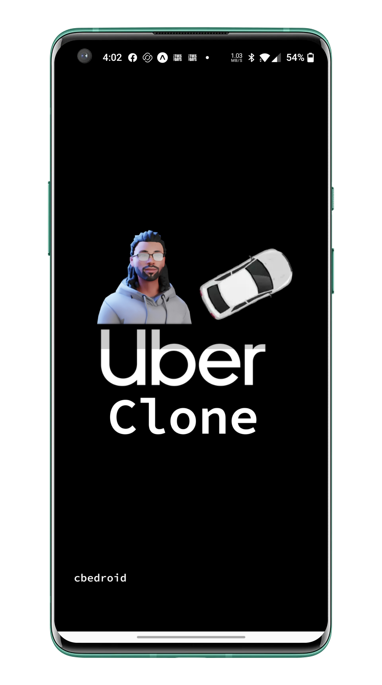

|ios|_  |android|_ |web|_

==============
Uber Clone 
==============

A React Native Uber passenger clone app built using the latest version of react,expo and reduxJS.

Technologies
------------

- `React Native <https://reactnative.dev/>`_ - is an open source JavaScript framework from Facebook designed to build native mobile apps for iOS and Android.
- `React Native Elements <https://reactnativeelements.com/>`_ - is a React Native framework for making cross platform applications
- `Expo <https://expo.dev/>`_ - is a framework and platform for React Native that help you develop, build, and deploy iOS, Android, and web apps.
- `Firebase <https://firebase.google.com/>`_ - is a cloud platform developed by Google for creating mobile and web application.
- `FireStore <https://firebase.google.com/docs/firestore>`_ - Cloud Firestore is a flexible, scalable database for mobile, web, and server development from Firebase and Google Cloud. 
- `ReduxJS/ToolKit <https://redux-toolkit.js.org/>`_ - is one of the most powerful libraries for managing states in react applications.
- `React Navigation <https://reactnavigation.org/>`_ - is a routing and navigation framework for Expo and React Native apps.
- `TailWind CSS <https://docs.nativescript.org/plugins/tailwindcss.html#usage>`_ - is native CSS self-described as a utility first CSS framework.
- `Android Studio <https://developer.android.com/studio/>`_ -  is the official Integrated Development Environment (IDE) for android application development.
- `IOS Emulator <https://docs.expo.dev/workflow/ios-simulator/>`_ - is a software that allows a windows system to run and install iOS applications or games on their PC.
- `React Native Maps <https://github.com/react-native-maps/react-native-maps>`_ - is a  React Native component system for maps.
- `MapQuest API <https://developer.mapquest.com/>`_ - is an open-source API Service used to build sophisticated location-based apps for Web, iOS, and Android.
- `Google Maps <https://developers.google.com/maps/apis-by-platform>`_ - is a Google web mapping platform and consumer application.
- `Google Directions API <https://developers.google.com/maps/documentation/directions/overview>`_ - is an open-source web service that uses HTTP requests to return formatted directions and locations. 
- `Google Places API <https://developers.google.com/maps/documentation/places/web-service/overview>`_ - is a API service that using HTTP requests to returns geographic locations, or prominent points of interest.
- `Google Distance Matrix API <https://developers.google.com/maps/documentation/distance-matrix/start>`_ - is a service that provides travel distance and time for a matrix of origins and destinations.
- `ESLint <http://eslint.org>`_ , `Airbnb Javascript/React Styleguide <https://github.com/airbnb/javascript>`_ - is a static code analysis tool for identifying problematic patterns found in JavaScript code.
- `eslint-plugin-import  <https://github.com/import-js/eslint-plugin-import>`_ - is linting plugin for Javascript that import/export syntax, and prevents misspelling of file paths and import names.

APP UI/UX Designs
------------------

App Design for Uber passenger app 2022

|splashScreen| |safetyScreen|

|homeScreen| |searchScreen| 

|rideScreenSelected| |confirmFareScreen|

|driverScreenDefault| |driverScreenBottom|

    
    
.. |homeScreen| image:: ./.github/assets/home_screen.png
    :alt: Home Screen
    :width: 45%
    

.. |searchScreen| image:: ./.github/assets/search_screen.png
    :alt: Search Screen
    :width: 45% 

.. |rideScreenSelected| image:: ./.github/assets/ride_screen_selected.png
    :alt: Ride Screen Selected
    :width: 45% 

.. |confirmFareScreen| image:: ./.github/assets/confirm_fare_screen.png
    :alt: Confirm Fare Screen 
    :width: 45% 

.. |driverScreenDefault| image:: ./.github/assets/driver_screen_default.png
    :alt: Driver Screen Default
    :width: 45% 

.. |driverScreenBottom| image:: ./.github/assets/driver_screen_bottom.png
    :alt: Driver Screen Bottom
    :width: 45% 

.. |ios| image:: https://img.shields.io/badge/iOS-4630EB.svg?style=flat-square&logo=APPLE&labelColor=999999&logoColor=fff
    :alt: IOS
    :width: 75
    :height: 25
    
.. |android| image:: https://img.shields.io/badge/Android-4630EB.svg?style=flat-square&logo=ANDROID&labelColor=A4C639&logoColor=fff
    :alt: android
    :width: 75
    :height: 25
.. |web| image:: https://img.shields.io/badge/web-4630EB.svg?style=flat-square&logo=GOOGLE-CHROME&labelColor=4285F4&logoColor=fff
    :alt: web
    :width: 75
    :height: 25
    
.. _ios: https://itunes.apple.com/app/apple-store/id982107779
.. _android: https://play.google.com/store/apps/details?id=host.exp.exponent&referrer=blankexample
.. _web: https://docs.expo.dev/workflow/web/

