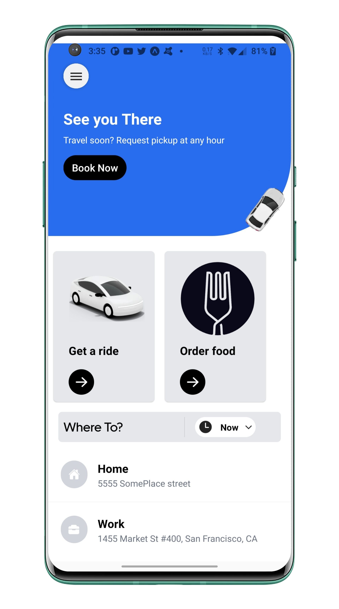
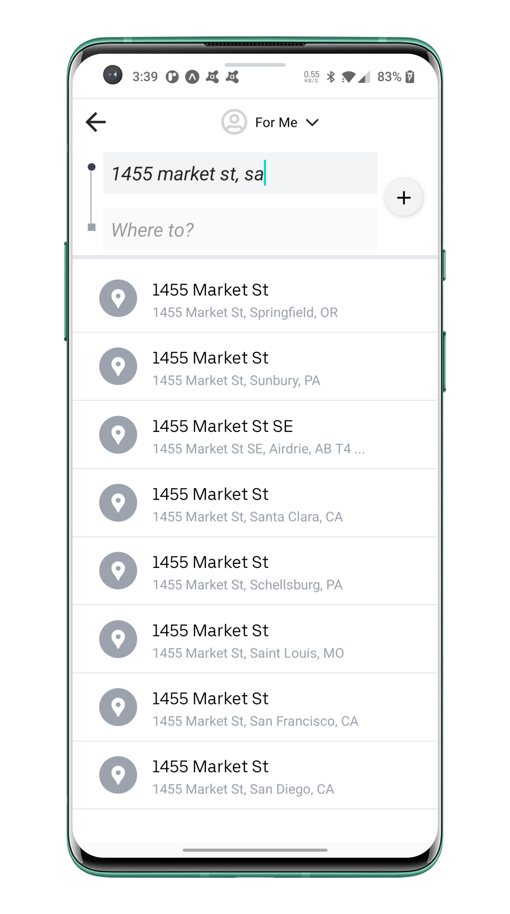
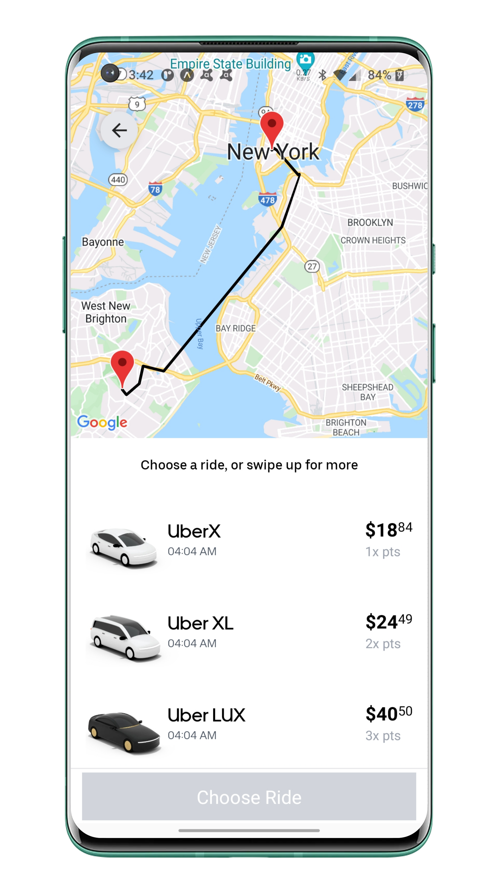
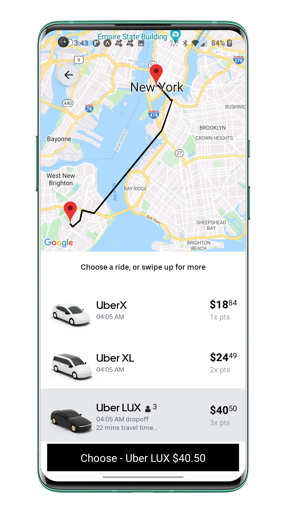
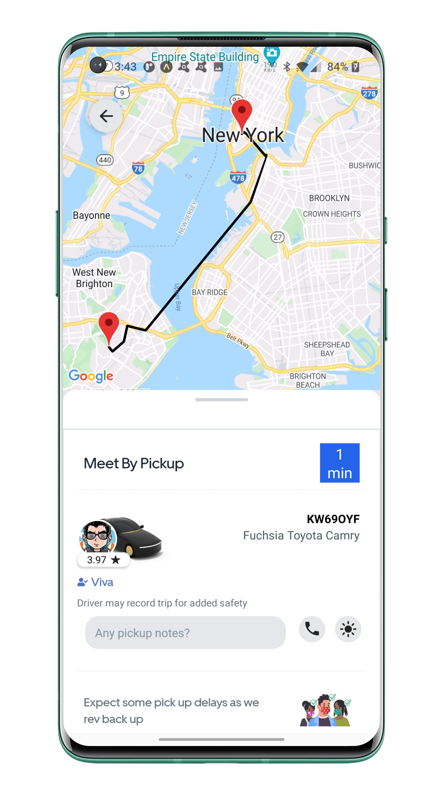
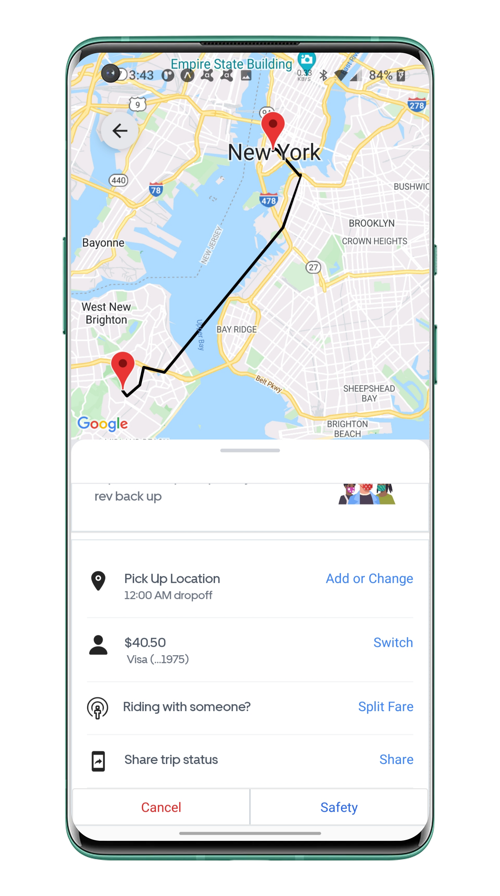

==============
Uber Clone 
==============

A  Uber clone mobile app built using the latest react native and reduxJS.

Technologies
------------

- `React Native <https://reactnative.dev/>`_
- `React Native Elements <https://reactnativeelements.com/>`_
- `Expo <https://expo.dev/>`_
- `ReduxJS/ToolKit <https://redux-toolkit.js.org/>`_
- `React Navigation <https://reactnavigation.org/>`_
- `TailWind CSS <https://docs.nativescript.org/plugins/tailwindcss.html#usage>`_ - native CSS
- `Android Studio <https://developer.android.com/studio/>`_
- `IOS Emulator <https://docs.expo.dev/workflow/ios-simulator/>`_
- `React Native Maps <https://github.com/react-native-maps/react-native-maps>`_
- `Google Maps <https://developers.google.com/maps/apis-by-platform>`_
- `Google Directions API <https://developers.google.com/maps/documentation/directions/overview>`_
- `Google Places API <https://developers.google.com/maps/documentation/places/web-service/overview>`_
- `Google Distance Matrix API <https://developers.google.com/maps/documentation/distance-matrix/start>`_
- `ESLint <http://eslint.org>`_ , `Airbnb Javascript/React Styleguide <https://github.com/airbnb/javascript>`_
- `eslint-plugin-import  <https://github.com/import-js/eslint-plugin-import>`_

Designs
--------

|homeScreen| 

|searchScreen| |confirmFareScreen|

|rideScreenDefault| |rideScreenSelected|

|driverScreenDefault| |driverScreenBottom|

    

.. |confirmFareScreen| image:: ./.github/assets/confirm_fare_screen.png
    :alt: Confirm Fare Screen 
    :width: 45% 

